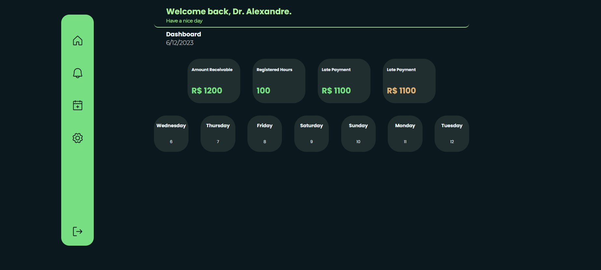

<h1 align="center"> On Call </h1>

  No atual estágio do curso Explore da @rocketseat foi lançado o desafio de fazer um projeto pessoal totalmente do zero e da minha escolha. Então, optei por fazer um agendamento para plantões voltados para profissionais da saúde no qual irá fazer o controle das datas, valores a serem pagos, horas trabalhadas no mês e valor a receber inclusive em atraso por meio de notificações.
Este é um projeto que tenho o desejo de trazer totalmente para o mobile, porém como foi sugerido esse desafio não pude perder a oportunidade de tentar fazer desktop e ja ir organizando as ideias pois muito raciocinio pode ser reaproveitado.
O projeto esta em uma fase bem inicial mas já estou bem feliz em conseguir tirar da minha cabeça essa ideia e ver virando algo palpavel.  

  <a href="#-tecnologias">Tecnologias</a>&nbsp;&nbsp;&nbsp;|&nbsp;&nbsp;&nbsp;
  <a href="#-projeto">Projeto</a>&nbsp;&nbsp;&nbsp;|&nbsp;&nbsp;&nbsp;
  <a href="#-layout">Layout</a>&nbsp;&nbsp;&nbsp;|&nbsp;&nbsp;&nbsp;
  <a href="#memo-licença">Licença</a>

  
  

 

  
  

## 🚀 Tecnologias

Esse projeto foi desenvolvido com as seguintes tecnologias:

- HTML e CSS
- JavaScript
- Git e Github

## 💻 Projeto

Projeto criado com intuito de realizar agendamentos de plantões para profissionais da saúde, auxiliando-os com datas e valores desses plantões.

## :memo: Licença

Esse projeto está sob a licença MIT.
